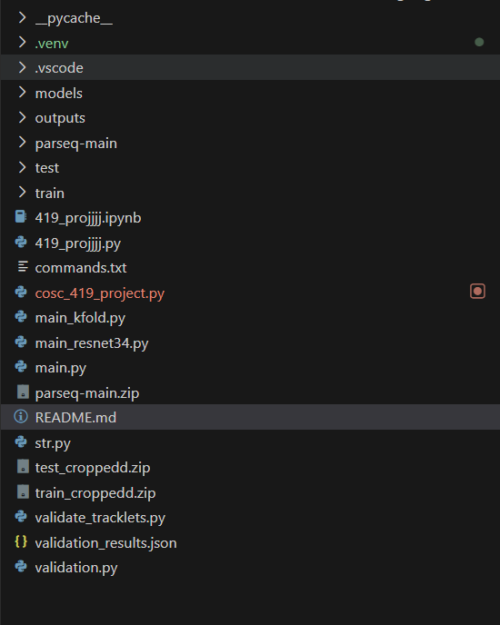

# SoccerNet Project Setup and Usage Guide

This repository contains our COSC 419 project code for jersey number recognition using PARSeq, plus scripts for legibility filtering, training, and validation.

This README is written so a teammate can set up the project from scratch and understand how the root-level scripts interact with the nested folders.

## What This Project Does

At a high level, the workflow is:

1. Read tracklet images from `train/image/` or `test/`.
2. Use ground-truth labels from `train/train_gt.json` or `test/test_gt.json`.
3. Optionally run a legibility filter to keep only readable jersey crops.
4. Convert the selected images into LMDB format for PARSeq.
5. Train or fine-tune a PARSeq model.
6. Validate predictions at the frame level and optionally at the tracklet level.

## Important Rule

Run all root-level scripts from the project root directory.

In other words, commands like `python main.py ...` and `python validation.py ...` should be run while your terminal is in the folder that contains:

- `main.py`
- `validation.py`
- `validate_tracklets.py`
- `parseq-main/`
- `train/`
- `test/`

This matters because the scripts use relative paths such as `parseq-main`, `train/train_gt.json`, and `test/test_gt.json`.

## Project Folder Structure

Below is the structure that matters most for teammates.

```text
root/
├── README.md
├── commands.txt
├── main.py
├── main_kfold.py
├── main_resnet34.py
├── validation.py
├── validate_tracklets.py
├── str.py
├── cosc_419_project.py
├── 419_projjjj.py
├── 419_projjjj.ipynb
├── models/
│   ├── legibility_resnet34_soccer_20240215.pth
│   └── parseq_epoch=24-step=2575-val_accuracy=95.6044-val_NED=96.3255.ckpt
├── outputs/
│   └── ... generated experiment folders ...
├── parseq-main/
│   ├── train.py
│   ├── test.py
│   ├── read.py
│   ├── pyproject.toml
│   ├── requirements/
│   └── strhub/
├── train/
│   ├── train_gt.json
│   └── image/
│       ├── 0/
│       ├── 1/
│       └── ... one folder per tracklet ...
└── test/
		├── test_gt.json
		├── 0/
		├── 1/
		└── ... one folder per tracklet ...
```


## What The Main Files Are For

### Root scripts

- `main.py`
	Standard PARSeq training pipeline using the root dataset.
	It can:
	- sample a fraction of the data,
	- optionally score legibility,
	- create LMDB files for PARSeq,
	- train or fine-tune a PARSeq model.

- `main_kfold.py`
	Same overall idea as `main.py`, but performs K-fold cross-validation and writes a `kfold_summary.json`.

- `main_resnet34.py`
	Training pipeline that uses the ResNet34 legibility checkpoint in `models/`.
	It also supports `--only-legibility`, which is useful if you only want legibility outputs and do not want to train PARSeq yet.

- `validation.py`
	Validates a trained PARSeq checkpoint on a set of images and writes `validation_results.json`.

- `validate_tracklets.py`
	Similar to `validation.py`, but explicitly supports `--vote-mode weighted` or `--vote-mode majority` for tracklet-level voting.

- `str.py`
	Older or separate PARSeq evaluation/inference script. It is not part of the main pipeline, but can still be used for custom inference or testing if needed.

### Nested dependency repo

- `parseq-main/`
	Bundled PARSeq repository used by our training scripts.
	The root scripts call `parseq-main/train.py` internally using `subprocess`, so this folder must remain present.

### Data and model folders

- `train/`
	Training set.

- `test/`
	Validation or held-out test set.

- `models/`
	Stores pretrained checkpoints, including the legibility ResNet34 model and some PARSeq checkpoints.

- `outputs/`
	Stores generated experiment outputs such as:
	- legibility score files,
	- kept-sample lists,
	- LMDB datasets,
	- training runs,
	- checkpoints,
	- summary JSON files.

## Expected Dataset Layout

The root scripts expect tracklet folders.

### Training data

```text
train/
├── train_gt.json
└── image/
		├── 0/
		│   ├── frame_001.jpg
		│   ├── frame_002.jpg
		│   └── ...
		├── 1/
		└── ...
```

### Test data

```text
test/
├── test_gt.json
├── 0/
│   ├── frame_001.jpg
│   └── ...
├── 1/
└── ...
```

### Ground-truth JSON format

The JSON files map tracklet folder IDs to jersey labels.

Example:

```json
{
	"0": 23,
	"1": 7,
	"2": -1
}
```

Notes:

- The key is the tracklet folder name.
- The value is the jersey number.
- A label of `-1` means unknown or invalid and is usually skipped unless explicitly included.

## Environment Setup

### 1. Install Python

Use Python 3.9 or newer.

PARSeq's bundled configuration expects Python 3.9+.

### 2. Create and activate a virtual environment

From the project root:

```powershell
python -m venv .venv
.\.venv\Scripts\Activate.ps1
```

If PowerShell blocks activation, run this once in the current shell and try again:

```powershell
Set-ExecutionPolicy -Scope Process Bypass
```

### 3. Upgrade pip

```powershell
python -m pip install --upgrade pip
```

### 4. Install dependencies

The safest reproducible setup is to install the bundled PARSeq requirements and then install `parseq-main` in editable mode.

From the project root:

```powershell
python -m pip install -r .\parseq-main\requirements\core.txt
python -m pip install -r .\parseq-main\requirements\train.txt
python -m pip install -e .\parseq-main
```

This installs the main packages used by the root scripts, including:

- `torch`
- `torchvision`
- `pytorch-lightning`
- `lmdb`
- `opencv-python`
- `pillow`
- `numpy`
- `tqdm`

### 5. GPU note

The provided `parseq-main/requirements/core.txt` is set up for CPU wheels by default.

If you want GPU training:

1. Install a matching CUDA-enabled `torch` and `torchvision` build from the official PyTorch instructions.
2. Then install the remaining requirements.

If you are unsure, use the CPU setup first to verify the environment.

## Quick Start Checklist

Before running anything, confirm all of the following:

- You are in the project root directory.
- Your virtual environment is activated.
- `parseq-main/` exists.
- `train/train_gt.json` exists for training.
- `train/image/` exists for training.
- `test/test_gt.json` exists for validation on the test split.
- `models/legibility_resnet34_soccer_20240215.pth` exists if you want to use `main_resnet34.py`.

## Primary Workflows

## Workflow 1: Standard PARSeq training with `main.py`

This is the default starting point for training.

### Basic command

```powershell
python main.py
```

Default behavior:

- uses `train/train_gt.json`,
- reads images from `train/image/`,
- uses `20%` of valid tracklets,
- trains for `10` epochs,
- writes outputs to `outputs/parseq_train/`.

### Common variants

Train on all data:

```powershell
python main.py --full-data
```

Train for more epochs:

```powershell
python main.py --epochs 20
```

Use half the data:

```powershell
python main.py --data-fraction 0.5
```

Fine-tune from an existing PARSeq checkpoint:

```powershell
python main.py --pretrained-model "outputs\parseq_e20_v2\train_run\checkpoints\epoch=18-step=380-val_accuracy=94.6860-val_NED=95.9742.ckpt"
```

Use precomputed legibility-kept samples instead of rescoring images:

```powershell
python main.py --legibility-precomputed "outputs\parseq_train\legibility_kept_samples_legible.txt" --epochs 20 --pretrained-model "outputs\parseq_e20_v2\train_run\checkpoints\epoch=18-step=380-val_accuracy=94.6860-val_NED=95.9742.ckpt" --output-dir "outputs\parseq_e20_v2" --max-label-length 2
```

Actually remove illegible images instead of just reporting them:

```powershell
python main.py --filter-by-legibility
```

Skip legibility scoring entirely:

```powershell
python main.py --skip-legibility
```

### Main arguments for `main.py`

- `--data-fraction FLOAT`
	Fraction of valid tracklets to use. Default is `0.2`.

- `--full-data`
	Use all available valid tracklets.

- `--epochs INT`
	Number of training epochs. Default is `10`.

- `--output-dir PATH`
	Output folder for this run. Default is `outputs/parseq_train`.

- `--skip-legibility`
	Do not run legibility classification.

- `--legibility-precomputed PATH`
	Load a previously generated kept-samples file and skip rescoring.

- `--filter-by-legibility`
	Drop illegible images from the training data.

- `--val-fraction FLOAT`
	Validation split fraction. Default is `0.2`.

- `--seed INT`
	Random seed. Default is `42`.

- `--gt-path PATH`
	Training ground-truth JSON file. Default is `train/train_gt.json`.

- `--pretrained-model PATH`
	Existing PARSeq checkpoint to fine-tune from.

- `--max-label-length INT`
	Maximum jersey-number length. Default is `2`.

### What `main.py` writes

Inside the selected output directory, expect files and folders like:

```text
outputs/<your_run>/
├── parseq_data/
│   ├── train/custom/
│   └── val/custom/
└── train_run/
		└── checkpoints/
```

Depending on the path used, it may also produce legibility score artifacts such as:

- `parseq_data/legibility_scores.json`
- `parseq_data/legibility_summary.json`
- `parseq_data/legibility_kept_samples.txt`
- `parseq_data/legibility_kept_samples_legible.txt`

## Workflow 2: K-fold training with `main_kfold.py`

Use this when you want cross-validation instead of a single train/validation split.

### Basic command

```powershell
python main_kfold.py --full-data --epochs 10 --k-folds 5 --output-dir outputs\parseq_tracklet_split_ft
```

### Useful variants

Use precomputed kept samples:

```powershell
python main_kfold.py --legibility-precomputed "outputs\parseq_train\legibility_kept_samples.txt" --k-folds 5 --epochs 10 --output-dir outputs\parseq_tracklet_split_ft
```

Fine-tune from a checkpoint during each fold:

```powershell
python main_kfold.py --full-data --pretrained-model "outputs\parseq_e20_v2\train_run\checkpoints\epoch=18-step=380-val_accuracy=94.6860-val_NED=95.9742.ckpt"
```

### Main arguments for `main_kfold.py`

`main_kfold.py` supports nearly the same flags as `main.py`, plus:

- `--k-folds INT`
	Number of folds. Default is `5`.

### What `main_kfold.py` writes

- one folder per fold, such as `fold_1/`, `fold_2/`, etc.,
- per-fold `parseq_data/` and `train_run/` folders,
- `kfold_summary.json` in the main output directory.

## Workflow 3: ML legibility pipeline with `main_resnet34.py`

Use this when you want to use the trained ResNet34 legibility classifier in `models/legibility_resnet34_soccer_20240215.pth`.

### Legibility only

This mode scores crops and stops before PARSeq training.

```powershell
python main_resnet34.py --only-legibility --full-data --output-dir outputs\resnet34_legibility
```

### Legibility plus PARSeq training

```powershell
python main_resnet34.py --full-data --filter-by-legibility --epochs 10 --output-dir outputs\parseq_e20_v2
```

### Adjust the classification threshold

```powershell
python main_resnet34.py --only-legibility --legibility-threshold 0.90 --output-dir outputs\resnet34_legibility
```

### Main arguments for `main_resnet34.py`

- `--only-legibility`
	Run the legibility model and stop before LMDB creation and PARSeq training.

- `--legibility-model-path PATH`
	Path to the ResNet34 legibility checkpoint.

- `--legibility-threshold FLOAT`
	Score threshold used to decide if a crop is legible. Default is `0.85`.

- `--filter-by-legibility`
	Drop illegible images before PARSeq training.

- `--val-fraction FLOAT`
	Validation fraction. Default is `0.1` in this script.

### What `main_resnet34.py` writes

In `--only-legibility` mode, it writes:

- `legibility_scores.json`
- `legibility_kept_samples.txt`
- `legibility_summary.json`

If training continues after scoring, it also writes PARSeq LMDB data and a `train_run/` folder with checkpoints.

## Validation Commands

## Option A: Frame-level validation with `validation.py`

Use this to test a trained checkpoint on a random sample of images.

### Example on the test set

```powershell
python validation.py --checkpoint "outputs\parseq_e20_v2\train_run\checkpoints\epoch=19-step=400-val_accuracy=95.6522-val_NED=96.3768.ckpt" --num-samples 500
```

### Example with explicit kept-samples filtering

```powershell
python validation.py --checkpoint "outputs\parseq_e20_v2\train_run\checkpoints\epoch=19-step=400-val_accuracy=95.6522-val_NED=96.3768.ckpt" --kept-samples "outputs\parseq_train\legibility_kept_samples_legible.txt" --image-dir test --gt-path test\test_gt.json --num-samples 500 --tracklet-vote
```

### Important arguments

- `--checkpoint PATH`
	Required model checkpoint.

- `--gt-path PATH`
	Ground-truth JSON file. Default is `test/test_gt.json`.

- `--kept-samples PATH`
	Optional kept-samples file from training, used to exclude training images.

- `--image-dir PATH`
	Image root. Default is `test`.

- `--num-samples INT`
	Number of images to evaluate.

- `--max-pred-len INT`
	Maximum prediction length. Default is `2`.

- `--include-unknown`
	Include `-1` labels in the metrics.

- `--tracklet-vote`
	Also report tracklet-level voting accuracy.

### Output

This script writes:

- `validation_results.json`

in the project root unless you change the script.

## Option B: Tracklet voting with `validate_tracklets.py`

Use this when you want frame predictions aggregated into one prediction per tracklet.

### Example from your command history

```powershell
python validate_tracklets.py --checkpoint outputs\parseq_e20_v2\train_run\checkpoints\epoch=19-step=400-val_accuracy=95.6522-val_NED=96.3768.ckpt --gt-path train\train_gt.json --image-dir train\image --kept-samples outputs\parseq_train\legibility_kept_samples_legible.txt --num-samples 1000 --vote-mode weighted
```

Another example:

```powershell
python validate_tracklets.py --checkpoint outputs\parseq_tracklet_split_ft\train_run\checkpoints\epoch=4-step=1750-val_accuracy=77.5632-val_NED=81.9084.ckpt --gt-path train\train_gt.json --image-dir train\image --kept-samples outputs\parseq_train\legibility_kept_samples_legible.txt --num-samples 5000 --vote-mode weighted
```

### Additional argument

- `--vote-mode weighted|majority`
	Choose confidence-weighted voting or plain majority voting.

All other major arguments match `validation.py`.

### Output

This script also writes:

- `validation_results.json`

## Using `str.py`

`str.py` is not the main pipeline, but it can still be useful for direct inference or custom evaluation.

Example:

```powershell
python str.py "outputs\parseq_e20_v2\train_run\checkpoints\epoch=19-step=400-val_accuracy=95.6522-val_NED=96.3768.ckpt" --inference --data_root test --result_file outputs\preds.json
```

Notes:

- It loads a checkpoint directly.
- It can dump raw predictions to a JSON file.
- It is more specialized than the main validation scripts.

## Recommended Team Workflow

If a teammate is setting this up for the first time, this is the easiest order to follow.

### Step 1: Create environment and install dependencies

```powershell
python -m venv .venv
.\.venv\Scripts\Activate.ps1
python -m pip install --upgrade pip
python -m pip install -r .\parseq-main\requirements\core.txt
python -m pip install -r .\parseq-main\requirements\train.txt
python -m pip install -e .\parseq-main
```

### Step 2: Verify the project layout

Confirm these exist:

- `parseq-main/`
- `train/train_gt.json`
- `train/image/`
- `test/test_gt.json`
- `models/legibility_resnet34_soccer_20240215.pth`

### Step 3: Run a simple training job

```powershell
python main.py --data-fraction 0.2 --epochs 5 --output-dir outputs\sanity_run
```

### Step 4: Validate the checkpoint

```powershell
python validation.py --checkpoint "outputs\sanity_run\train_run\checkpoints\<your_checkpoint>.ckpt" --num-samples 100
```

### Step 5: Run the larger experiment you actually want

Examples:

```powershell
python main.py --full-data --epochs 20 --output-dir outputs\parseq_full_run
```

```powershell
python main_kfold.py --full-data --epochs 10 --k-folds 5 --output-dir outputs\parseq_kfold_run
```

```powershell
python main_resnet34.py --only-legibility --full-data --output-dir outputs\resnet34_legibility
```

## Common Output Files Explained

- `legibility_scores.json`
	Per-image legibility results.

- `legibility_kept_samples.txt`
	Tab-separated file listing image paths and labels that were kept.

- `legibility_kept_samples_legible.txt`
	A kept-samples file used by some experiments and commands in this repo.

- `legibility_summary.json`
	Summary statistics for the legibility filtering step.

- `parseq_data/`
	Generated LMDB dataset used as training input to PARSeq.

- `train_run/checkpoints/`
	Checkpoints written by `parseq-main/train.py`.

- `kfold_summary.json`
	Cross-validation summary written by `main_kfold.py`.

- `validation_results.json`
	Detailed evaluation output written by validation scripts.

## Troubleshooting

### Error: `parseq-main` not found

Cause:
The script is not being run from the project root, or the `parseq-main/` folder is missing.

Fix:

- `cd` into the project root first.
- Confirm `parseq-main/` is inside the same folder as `main.py`.

### Error: `lmdb is not installed`

Fix:

```powershell
python -m pip install lmdb
```

### Error: checkpoint not found

Fix:

- Verify the full checkpoint path.
- Use quotes around the path if it contains special characters.
- Check inside `outputs/<run_name>/train_run/checkpoints/`.

### Error: no images or no labeled samples found

Fix:

- Confirm `train/image/` or `test/` exists.
- Confirm the tracklet folder names match the JSON keys.
- Confirm labels are not all `-1`.

### Error: PowerShell cannot activate `.venv`

Fix:

```powershell
Set-ExecutionPolicy -Scope Process Bypass
.\.venv\Scripts\Activate.ps1
```

## Notes For Teammates

- Keep the root scripts and the `parseq-main/` folder together.
- Do not move `train/`, `test/`, or `models/` somewhere else unless you also update the command arguments.
- Always run commands from the project root.
- Start with a small run before launching a long experiment.
- If you create a new experiment, give it a unique `--output-dir` so it does not overwrite older results.

## Short Command Reference

Environment setup:

```powershell
python -m venv .venv
.\.venv\Scripts\Activate.ps1
python -m pip install --upgrade pip
python -m pip install -r .\parseq-main\requirements\core.txt
python -m pip install -r .\parseq-main\requirements\train.txt
python -m pip install -e .\parseq-main
```

Standard training:

```powershell
python main.py --full-data --epochs 20 --output-dir outputs\parseq_full_run
```

K-fold training:

```powershell
python main_kfold.py --full-data --epochs 10 --k-folds 5 --output-dir outputs\parseq_kfold_run
```

Legibility only:

```powershell
python main_resnet34.py --only-legibility --full-data --output-dir outputs\resnet34_legibility
```

Validation:

```powershell
python validation.py --checkpoint "outputs\parseq_full_run\train_run\checkpoints\<checkpoint>.ckpt" --num-samples 500
```

Tracklet validation:

```powershell
python validate_tracklets.py --checkpoint "outputs\parseq_full_run\train_run\checkpoints\<checkpoint>.ckpt" --gt-path test\test_gt.json --image-dir test --num-samples 500 --vote-mode weighted
```
